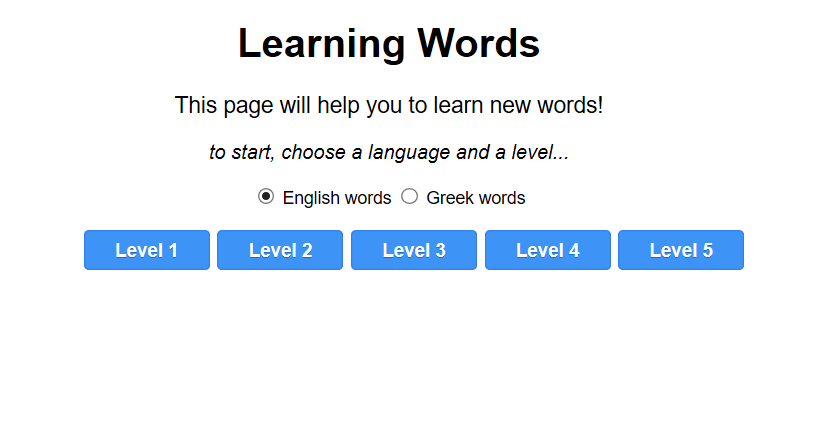
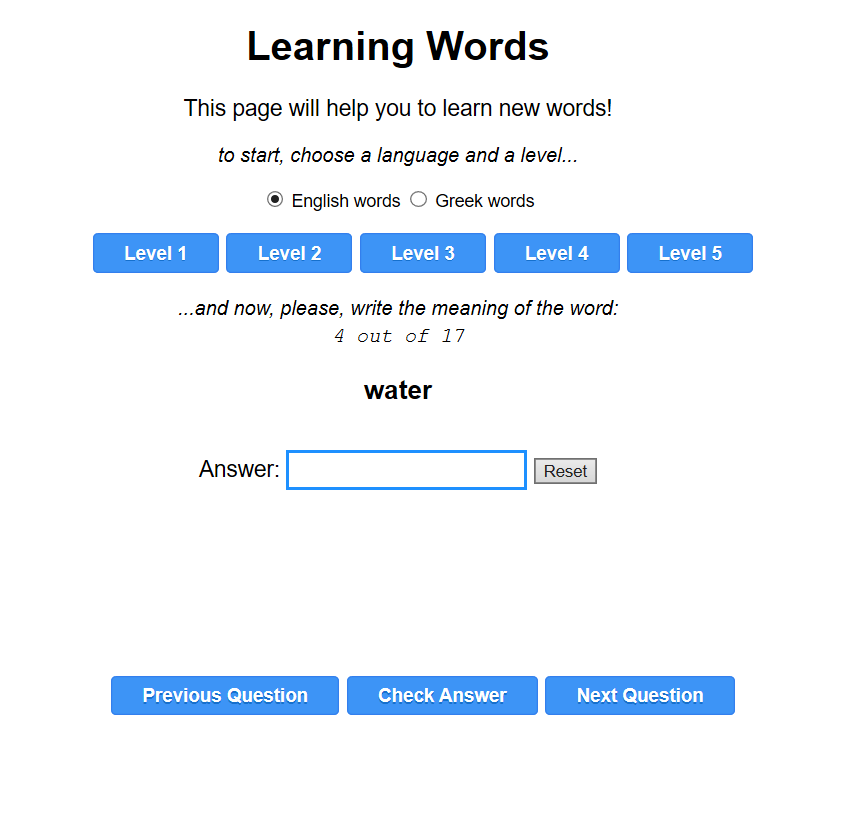
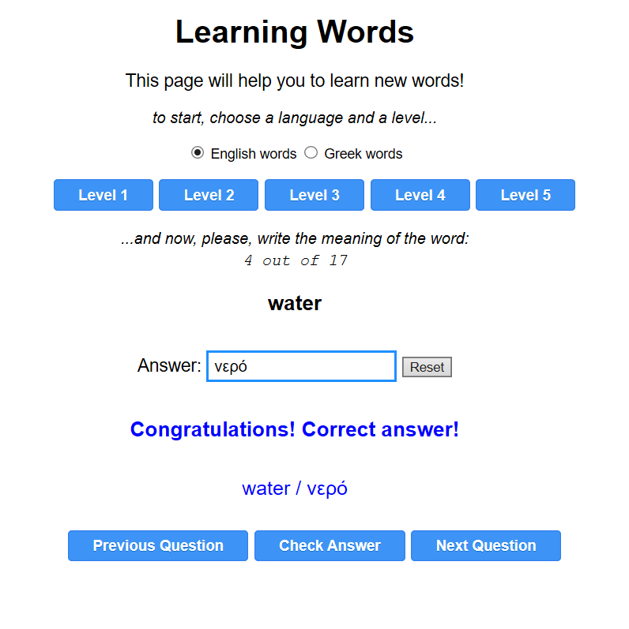
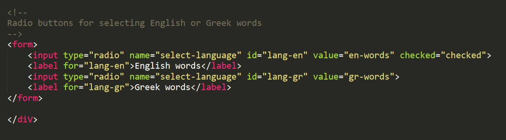

# Words

## Learning words

### Learning new words from English to another language and vice versa.

This web-app helps you to learn new words in any language you would like to.  

The app contains only a few sample words, but it can be easily expanded to include the words of your choice, in the languages of your choice.  

The app was initially build in order to help Greek students to learn English words. For this reason, the app contains two arrays with English-Greek words. As the app can be easily customized in the languages of your choice, it also includes an array with French-English word and an array with French-Greek words.

Also, included is a sample array to demonstrate the proper syntax in order to create an array of words in the languages of your choice.

## How to use the web-app

Below you can see the interface of the app when it starts.

After selecting a language and a level, the rest of the options appear and the app asks for the meaning of a word.

If a correct answer is given, a message with the complete answer appears in blue.

If the answer is not correct, then a message appears in red color and the complete answer is shown on the screen.

After you type an answer, you could hit enter or click the "Check Answer" button to see if the answer is correct or not.

Keep in mind also that every time you click one of the "Levels", the words inside that level are randomized so that every time you select that level will appear in a different order.

## Background information

This web-app is built using HTML, CSS and JavaScript. Usually, the code is separated in different files but for simplicity, the complete code has been included in a single HTML file, where there are sections for the CSS and the JavaScript code.

This has the advantage that the file can be easily edited, used and shared, as it is a single file without any dependencies. If downloaded, it will work without internet connection.

If used through a web-page, an internet connection will only be needed to initially access the web-app, while after that, there is no need for an internet connection, as the web-app does not access the internet at any point because all the data needed are stored inside the single file.

## Editing the included words

The web-app contains a few sample words but it's very easy to edit this information and include your own words. If you are familiar with JavaScript, the process is obvious, but even if you don't know anything about programming, it would be very easy to update this information.  

First though, you will need to know a few basic things on JavaScript arrays, as all the words are stored in arrays.  

In JavaScript, an array is simply a collection of data. To make an array, you declare it using the statement "const" and you give it a name and then you include your data, separated by commas, inside square brackets. At the end of the array, you add a semicolon ";" e.g.:

const myArray = [1, 2, 3, 4, 5];

Each of those numbers 1, 2, 3, 4 and 5 is called an item of the array. Those items can be various things, besides numbers.  

For example, they can be other arrays like:

const myArray = [1, [10, 12, 24], 3, [15, 215, 26], 5];

or

const myArray = [[1, 2, 3], [4, 5, 6], [7, 8, 9], [10, 11, 12], [13, 14, 14]];

which could also be written (for better readability) as:

const myArray = [  
	[1, 2, 3],   
	[4, 5, 6],   
	[7, 8, 9],   
	[10, 11, 12],   
	[13, 14, 14]  
];  

Arrays could also contain strings. In such a case, the strings have to be included inside quotes. Either double "double quotes" or single 'single quotes'. Single quotes are usually preffered, as they make the array easier to be read by people.

Here's an example:

const myArray = ['one', 'two', 'three', 'four', 'five'];

or

const myArray = ["one", "two", "three", "four", "five"];  

Arrays could also contain a combination of numbers and strings:

const myArray = ['one', 2, 'three', 4, 'five'];

## Word Arrays

This web-app uses arrays to store the foreign words and their meanings.

For simplicity and readability, each line holds only one foreign word and next to it, the meaning or the meanings of that word.

e.g. in the following array we can see a few French words and their translation to English with one or more words:

const myWords = [  
	['bateau', 'boat', 'ship'],  
	['soleil', 'sun', 'sunlight'],  
	['voyage', 'trip', 'journey'],  
	['merci', 'thanks', 'thank you'],  
	['bon', 'good', 'right', 'kind'],  
	['salut', 'hi', 'hello', 'bye'],  
	['nouveau', 'new', 'fresh'],  
	['école', 'school'],  
	['gentil', 'kind', 'good', 'nice'],  
	['professeur', 'teacher', 'professor']  
];  

So, following this conversion, it's rally easy to create new arrays with words.

## Customizing the web-app's interface

The simple interface is in English and if you are comfortable with coding, you could easily change it to your own language. Even though if you have no experience at all with coding, you can easily change the selection on the top, for either "English words" or "Greek Words" to your own preferences.

To do that, simply go to the place of the HTML code where those phrases appear, and replace the text with the languages of your choice.

As you can see in the above image, you only need to replace the white text (English words, Greek words) with the text of own choice.

## Saving the changes

If you make any changes to this app, make sure that you always save this file with utf-8 encoding, otherwise the characters will not appear correctly.

You can use any text editor to edit the file, while the simplest way is to use the notepad which is included in Windows or something similar for other operating systems.

Alternatively, in case you would like to use a better text editor to edit this file, or any other HTML file, here are some suggestions:  

[Notepad++ (Windows only)](https://notepad-plus-plus.org)  

[Atom](https://atom.io)  

[Visual Code](https://code.visualstudio.com)  

which are free, and

[Sublime text ](https://www.sublimetext.com)   

which has a trial period to use it.

Those text editors could be used for any kind of program i.e. a program written in any programming language.

The advantage of using one of the above editors, is that your code gets automatically highlighted for the language you are programming, which makes your programming experience a lot better compared to a simple text editor that doesn't highlight the language you are using.

## Preparing an array with words

Preparing an array with English words and their translations takes time, and thus, here's an approach to speed things up.

The easiest approach is to write the words in an Excel sheet, one column with the English words and the next column with their corresponding Greek word.

After that, we can use the concatenate operator in Excel, and combine the data to produce an array with the words, which will be ready to be inserted in this app.

So, let's assume that the following table corresponds to an Excel sheet and that we would like to combine the English word "creation", which means "δημιουργία" in Greek, to an array, together with the rest of the words.

English words | Greek words
--------------|------------
creation | δημιουργία
pencil | μολύβι
book | βιβλίο

The array would be like this:  

const myArray = [  
	["creation", "δημιουργία"],  
	["pencil", "μολύβι"],  
	["book", "βιβλίο"]  
];  

So, we add some extra columns in the Excel sheet with the symbols needed to create the array. i.e.  

A | B | c | D | E
--|---|---|---|---
[" | creation | ", " | δημιουργία | "],
[" | pencil | ", " | μολύβι | "],
[" | book | ", " | βιβλίο | "],

And then, in the column, we use the "&" operator to add all those string to one.  

A | B | c | D | E | F
--|---|---|---|---|---
[" | creation | ", " | δημιουργία | "], | = A1 & B1 & C1 & D1 & E1
[" | pencil | ", " | μολύβι | "], | = A2 & B2 & C2 & D2 & E2
[" | book | ", " | βιβλίο | "], | = A3 & B3 & C3 & D3 & E3

Using the above formula in column F, we will these results:

A | B | c | D | E | F
--|---|---|---|---|---
[" | creation | ", " | δημιουργία | "], | ["creation", "δημιουργία"],
[" | pencil | ", " | μολύβι | "], | ["pencil", "μολύβι"],
[" | book | ", " | βιβλίο | "], | ["book", "βιβλίο"],

Which can be easily transformed to an array like this:

const myArray = [  
	["creation", "δημιουργία"],  
	["pencil", "μολύβι"],  
	["book", "βιβλίο"]  
];  

## Licence

You can freely use this code provided that:  

### You love pets, or animals in general.   

Why? Because this is the singlest most important thing that reveals the true character of a person.  

If you behave nicely to animals, it's guaranteed that you would behave nicely to humans.  

Only an animal can inform you if you are becoming a better human being. No person can ever tell you this.

